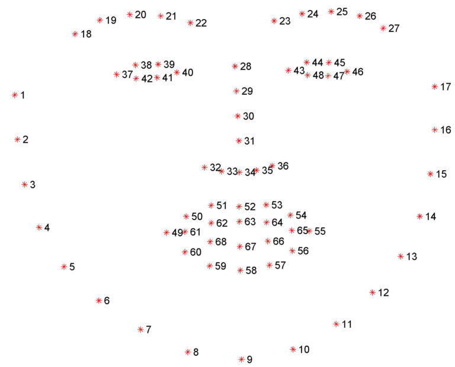
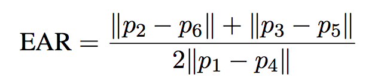
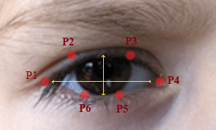

# DROWSINESS ALERT SYSTEM 
This is a drowsiness alert system in Python3 using OpenCV and Dlib libraries that plays an alarm when the user becomes drowsy. The system is implemented using the Flask microframework.

Reference: [Real-Time Eye Blink Detection using Facial Landmarks, Tereza Soukupova and Jan Cech,(2016)](http://vision.fe.uni-lj.si/cvww2016/proceedings/papers/05.pdf)

## Dependencies :
1. opencv
2. scipy
3. dlib
4. sounddevice
5. soundfile
6. numpy
7. Pre-trained Shape Predictor Dlib Model - shape_predictor_68_face_landmarks.dat (https://github.com/AKSHAYUBHAT/TensorFace/blob/master/openface/models/dlib/shape_predictor_68_face_landmarks.dat)

We detect facial features with OpenCV and Dlib
Play sound in python3 using soundfile and sounddevice 
HTML and CSS are used to Create a Flask application.


## Working :

● We utilised a pre trained frontal face detector from Dlib’s library which is based on  a modification to the Histogram of Oriented Gradients in combination with Linear  SVM for classification.  

● The pre-trained facial landmark detector inside the dlib library is used to estimate  the location of 68 (x, y)-coordinates that map to facial structures on the face. The 68  landmark output is shown in the figure below.



A shape detector is required as well, which is provided in the repo. Referring to the paper [Real-Time Eye Blink Detection using Facial Landmarks, Tereza Soukupova and Jan Cech,(2016)](http://vision.fe.uni-lj.si/cvww2016/proceedings/papers/05.pdf), **Eye Aspect Ratio(EAR)** is given by the following formula :

The EAR ratio is calculated for both the eyes in each frame. If it falls below a certain threshold value, the user’s
eyes are detected as ”drowsy”. If the user’s eyes are closed for a certain number of frames, a loud alarm is played.



where, p1,...,p6 are as shown below :




The coordinates for each landmark point can be found using the part number as listed in the Facial Landmarks picture above, which is then used to compute the Eye Aspect Ratio.

The authors of the above referred paper suggest to take the average of EAR of both eyes. A threshold is set for the EAR below which the driver is said to be drowsy. If the driver is 'drowsy' for 30 consecutive frames, a loud alarm sound is played in order to wake the driver up.

# Usage

To run the program, simply type the following command :
 ```
 python3 app.py
```
The application will greet you at : `http://localhost:5000/`
# Applications

Can be implemented on a microcontroller(after optimizing the code) and used in cars to sound an alarm if the driver is found to be drowsy.
